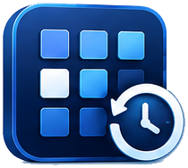

# ReDesk

**Desktop Icon Layout Manager for Windows 10 / 11**

Save. Restore. Travel back in time.

### [🌐 เว็บไซต์ / Website](https://ziggaza.github.io/redesk/) · [⬇ ดาวน์โหลด / Download](https://github.com/ziggaza/redesk/releases/latest)

---

## ภาษาไทย

ถอดจอเสริมตอนเลิกงาน แล้วพรุ่งนี้ไอคอนกองรวมกันที่มุมซ้ายบน — ReDesk จำตำแหน่งไอคอนบนเดสก์ท็อปของคุณ
แล้วคืนค่ากลับให้อัตโนมัติทุกครั้งที่การต่อจอเปลี่ยน ไม่ว่าจะถอด-เสียบจอ เปลี่ยนความละเอียด หรือเปลี่ยน DPI scaling

**สิ่งที่ทำได้**

- บันทึกและคืนค่าตำแหน่งไอคอนแยกตามชุดจอภาพ ระบุจอด้วย EDID จึงไม่สับสนเมื่อสลับพอร์ต
- คืนค่าอัตโนมัติเมื่อการต่อจอเปลี่ยน หรือเมื่อ explorer.exe รีสตาร์ท
- เก็บภาพหน้าจอจริงของเดสก์ท็อปคู่กับทุก snapshot (เห็นเฉพาะวอลเปเปอร์กับไอคอน ไม่ติดหน้าต่างที่เปิดอยู่)
- โซนและหมุด — ล็อกไอคอนสำคัญไว้กับที่ และกำหนดพื้นที่ให้ไอคอนใหม่ไปกองรวมกันโดยไม่ทับของเดิม
- ไทม์ไลน์ย้อนดูการเปลี่ยนแปลง เปรียบเทียบก่อน-หลัง และย้อนกลับได้
- ทำงานเงียบ ๆ ใน System Tray ใช้แรมราว 20–40 MB และ CPU 0% ตอน idle
- ไทย / English และธีมมืด-สว่าง

**การติดตั้ง**

ไม่ต้องติดตั้ง ดาวน์โหลดไฟล์เดียวแล้วเปิดใช้ได้เลย ไม่ต้องใช้สิทธิ์ผู้ดูแลระบบ

| ไฟล์ | ขนาด | เหมาะกับ |
|---|---|---|
| [`ReDesk-win-x64.exe`](https://github.com/ziggaza/redesk/releases/latest/download/ReDesk-win-x64.exe) | ~66 MB | ทุกเครื่อง — รวม .NET runtime มาแล้ว |
| [`ReDesk-win-x64-net10.exe`](https://github.com/ziggaza/redesk/releases/latest/download/ReDesk-win-x64-net10.exe) | ~1.9 MB | เครื่องที่มี .NET 10 Desktop Runtime อยู่แล้ว |

> **อย่ารันด้วย Run as administrator** — ReDesk ต้องคุยกับ explorer.exe ผ่าน Shell COM ซึ่ง UAC จะบล็อก
> ถ้าโปรเซสอยู่ระดับสิทธิ์สูงกว่า การรันแบบผู้ใช้ปกติคือวิธีที่ถูกต้อง

**ความเป็นส่วนตัว** — ไม่มีโค้ดเชื่อมต่อเครือข่ายในแอปเลย ข้อมูลทั้งหมด (ตำแหน่งไอคอน ภาพหน้าจอ การตั้งค่า)
อยู่ใน `%LOCALAPPDATA%\ReDesk\` เป็นไฟล์ JSON และ JPEG ที่เปิดดูเองได้ ลบโฟลเดอร์นี้ก็คือถอนการติดตั้งเรียบร้อย

---

## English

Unplug the second monitor at the end of the day and tomorrow every icon is piled in the
top-left corner. ReDesk remembers where your desktop icons belong and puts them back
automatically whenever the display setup changes — monitors connected or removed,
resolution changes, DPI scaling changes.

**What it does**

- Saves and restores icon positions per monitor set, identifying displays by EDID so
  swapping ports never confuses it
- Restores automatically on display changes and after explorer.exe restarts
- Captures a real screenshot of the desktop alongside every snapshot — wallpaper and icons
  only, never the windows you had open
- Zones and pins: lock important icons in place and give new files a landing area instead
  of letting them cover something
- A timeline of every change, with before/after comparison and undo
- Lives in the system tray on 20–40 MB of RAM and 0% CPU when idle
- Thai / English, dark and light themes

**Install**

There is no installer. Download one file and run it; no admin rights required.

| File | Size | For |
|---|---|---|
| [`ReDesk-win-x64.exe`](https://github.com/ziggaza/redesk/releases/latest/download/ReDesk-win-x64.exe) | ~66 MB | Everyone — the .NET runtime is bundled |
| [`ReDesk-win-x64-net10.exe`](https://github.com/ziggaza/redesk/releases/latest/download/ReDesk-win-x64-net10.exe) | ~1.9 MB | Machines that already have the .NET 10 Desktop Runtime |

> **Do not run it as administrator.** ReDesk talks to explorer.exe through Shell COM, and
> UAC blocks that across integrity levels. Running as your normal user is the correct way.

**Privacy** — the app contains no network code at all. Everything (icon positions,
screenshots, settings) lives in `%LOCALAPPDATA%\ReDesk\` as JSON and JPEG you can open and
inspect. Deleting that folder is a complete uninstall.

---

This repository hosts the ReDesk website and downloads. ReDesk itself is closed-source. 
เก็บเฉพาะหน้าเว็บและไฟล์ดาวน์โหลด ตัวซอร์สโค้ดของ ReDesk ไม่ได้เปิดเป็นสาธารณะ

 

Powered by **ZigGaZa Studio**

